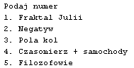
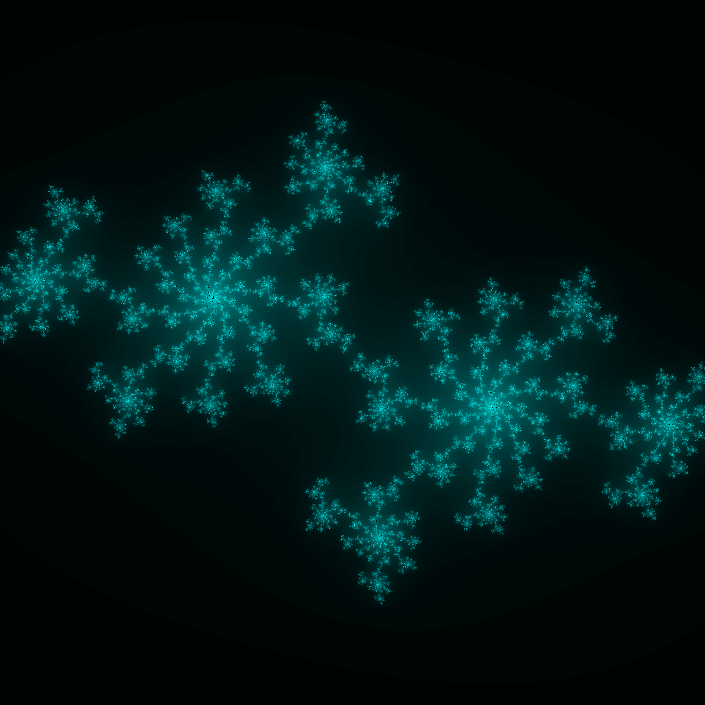
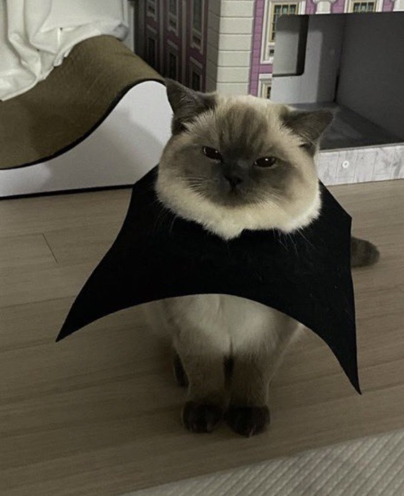
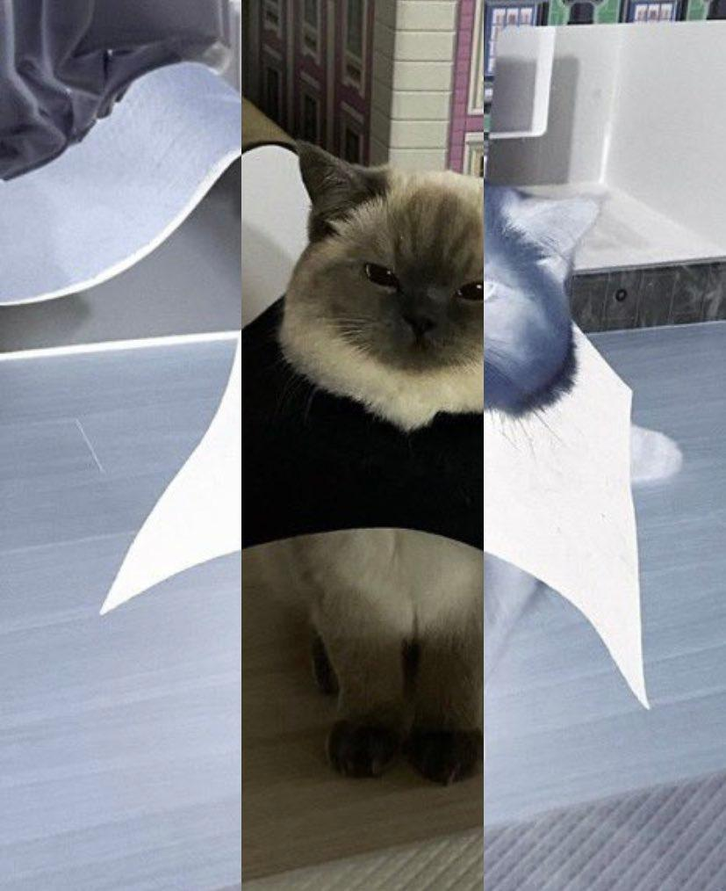
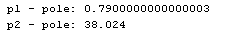
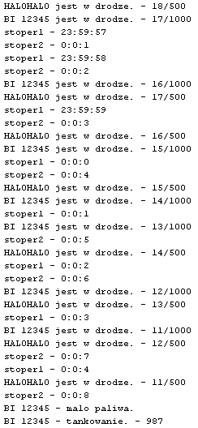
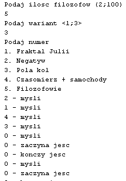

# PRiR zadania lab 3 - 4
<br>
1. Fraktal Julii
```javascript
class FJulia  extends Thread
```
<br>
2. Negatyw (przerobienie na negatyw 2/3 zdjęcia)
```javascript
class Negatyw extends Thread
```
<br>
<br>
3. Pola kol
```javascript
class PoleKolaMC extends Thread
```
<br>
4. Czasomierz + samochody
```javascript
class Samochod extends Thread
class Czasomierz extends Thread
```
<br>
5. Filozofowie
```javascript
class Filozofowie1 extends Thread
class Filozofowie2 extends Thread
class Filozofowie3 extends Thread
```
<br>
